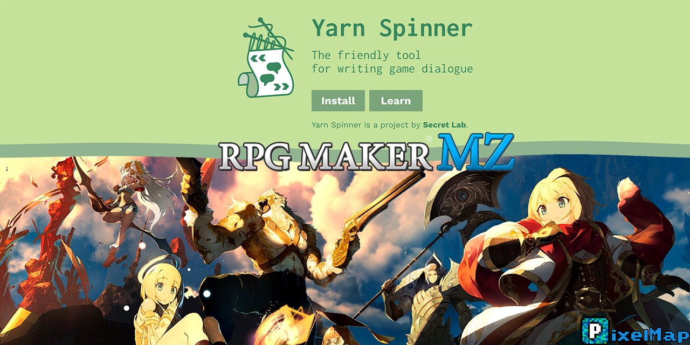

# RPGMaker MZ Yarn Spinner Plugin

[Yarn Spinner](https://yarnspinner.dev/) is a fantastic tool designed to make writing game dialogue easier.
It was created by the makers of "Night in the Woods", and now you can finally use it within your [RPGMaker MZ](https://www.rpgmakerweb.com/products/rpg-maker-mz) games! 
Here are some of the features:

* 25 Commands!
* 3 Functions!
* Stardew Valley mode (See guide for more information)
* Sample Dialog!

## Commands

## Demo

Commands allow Yarn Spinner to control parts of the game that you've built.

### Audio

| Name       | Signature                    | Documentation            |
| ---------- | ---------------------------- | ------------------------ |
| play_music | play_music music_name volume | Plays a music file       |
| play_sound | play_sound sound_name volume | Plays a sound file       |
| stop_music | stop_music duration          | Stops the playing music. |

### Camera

| Name           | Signature                                      | Documentation                                                                                                |
| -------------- | ---------------------------------------------- | ------------------------------------------------------------------------------------------------------------ |
| change_weather | change_weather weather_type intensity duration | Changes the weather to the specified weather type, with optional intensity and number of frames to blend in. |
| fade_in        | fade_in duration                               | Fade in the screen back to normal                                                                            |
| fade_out       | fade_out duration red green blue grey alpha    | Fade out the screen (to black, or optionally to a color)                                                     |
| flash_screen   | flash_screen duration red green blue intensity | Flash the screen (to white, or optionally to a color)                                                        |

### Event

| Name            | Signature                                                | Documentation                                                                                                                                                    |
| --------------- | -------------------------------------------------------- | ---------------------------------------------------------------------------------------------------------------------------------------------------------------- |
| hide_event      | hide_event entity_name                                   | Hides the entity with the given name.  If no entity provided, hides the calling entity                                                                           |
| move_event      | move_event event_name direction_name distance speed      | Move an event                                                                                                                                                    |
| move_self       | move_self direction_name distance speed                  | Move calling event                                                                                                                                               |
| set_facing      | set_facing direction event_name                          | Changes the direction the provided event name is facing.                                                                                                         |
| set_self_facing | set_self_facing direction                                | Changes the direction the calling event is facing.                                                                                                               |
| show_balloon    | show_balloon balloon_type event_name                     | Shows a balloon icon above an event.  Defaults to the calling event.  Can optionally pass in "player"for event_name if you'd like it to appear above the player. |
| show_event      | show_event event_name opacity                            | Shows the event (if it's hidden).  If no event name provided, defaults to calling event.                                                                         |
| sync_move_event | sync_move_event event_name direction_name distance speed | Move an event (Same as move_event, except blocks script execution until movement is complete)                                                                    |
| sync_move_self  | sync_move_self direction_name distance speed             | Move calling event (Same as move_self, except blocks script execution until movement is complete)                                                                |

### Message

| Name           | Signature              | Documentation                                                                                                                         |
| -------------- | ---------------------- | ------------------------------------------------------------------------------------------------------------------------------------- |
| set_background | set_background opacity | Sets the background of the message window; options are 0 (fully opaque), 1 (transparent), 2 (invisible background). The default is 0. |

### Player

| Name        | Signature                      | Documentation                                                                             |
| ----------- | ------------------------------ | ----------------------------------------------------------------------------------------- |
| add_gold    | add_gold amount                | Adds X amount of gold to the player                                                       |
| add_item    | add_item item_name quantity    | Adds an item with the provided name to the player's inventory, with an optional quantity. |
| remove_gold | remove_gold amount             | Remove X amount of gold to the player                                                     |
| remove_item | remove_item item_name quantity | Adds an item with the provided name to the player's inventory, with an optional quantity. |

### Script

| Name  | Signature     | Documentation                     |
| ----- | ------------- | --------------------------------- |
| wait  | wait duration | Waits for a given amount of time. |

### Teleport

| Name           | Signature                                  | Documentation                                                                                            |
| -------------- | ------------------------------------------ | -------------------------------------------------------------------------------------------------------- |
| set_level      | set_level map_name x y direction fade_type | Teleports the player to the specified map name, at a specific x and y.                                   |
| teleport_event | teleport_event event_name x y              | Teleports an event to the specified x and y.  If no event name specified, defaults to the calling event. |
| teleport_self  | teleport_self x y                          | Teleports an event to the specified x and y.  If no event name specified, defaults to the calling event. |

## Functions
Functions are units of code that Yarn scripts can call to receive a value.

| Name         | Signature              | Documentation                                             |
| ------------ | ---------------------- | --------------------------------------------------------- |
| has_item     | has_item(itemName)     | Returns true if the player has the specified item.        |
| item_count   | item_count(itemName)   | Returns the number of the given item the player has.      |
| random_range | random_range(min, max) | Given a min and max, return a random number between them. |

## Credits

* [Yarn Spinner](https://yarnspinner.dev/) - The Yarn Spinner engine
* [Yarn Bound](https://github.com/mnbroatch/yarn-bound) - Yarn 2.0 wrapper around bondage.js by mnbroatch.
* [Plugin Metadata](https://github.com/comuns-rpgmaker/plugin-metadata) - The plugin metadata generator by Comuns
